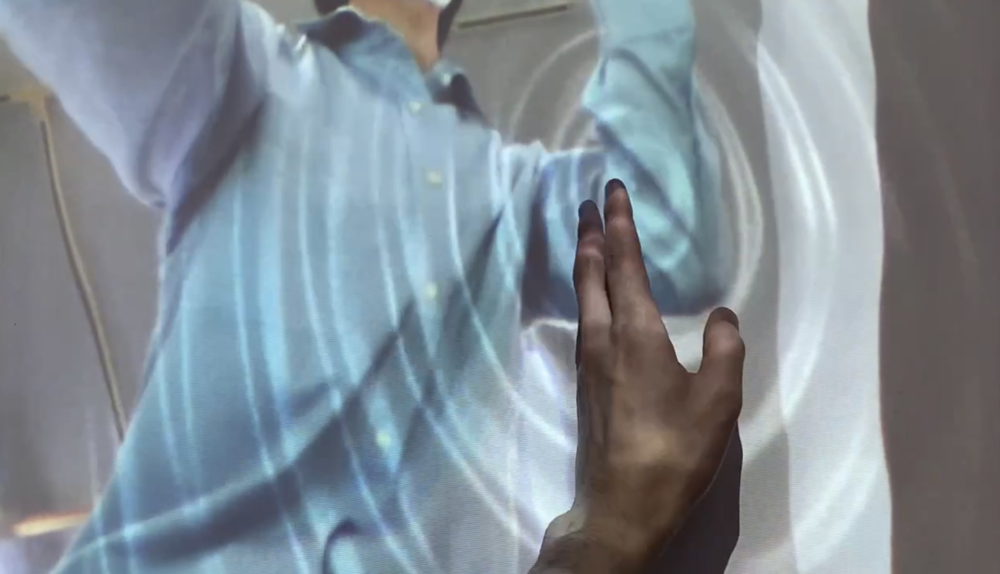
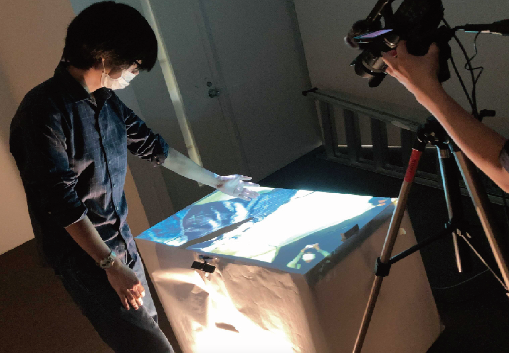

### wave

TouchDesigner,arduino uno,距離センサー,webカメラ,プロジェクタ
 
 
 

この作品はインタラクティブな水面をプロジェクションマッピングした作品です。テーブルに投影された水面に手で触れることで波紋が描画されるインタラクティブアートになっています。 
視覚的にはリアルな水面が描画されていて、触れると冷たい水の感触が伝わってきそうですが、実際に触れると乾いて硬いテーブルの感触が指に伝わってきます。 
そうした視覚と触覚という感覚の間のギャップを感じさせる作品になっています。

<video controls playsinline autoplay loop muted="true" src="../pics/wave.mp4" type="video/webm" width="100%">
 Sorry, your browser doesn't support embedded videos.
</video>

 
 
 

